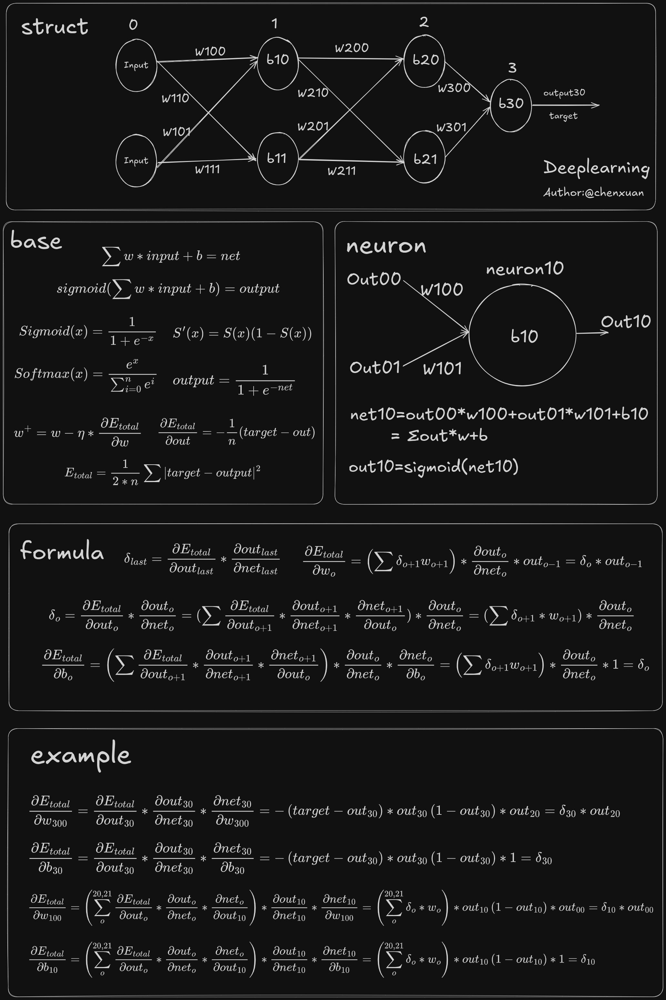

# deeplearning

一个**从零手写**的 C++ 深度学习小库：不依赖 PyTorch / TensorFlow，用 `std::vector` 和三重循环把 MLP、CNN、RNN、训练栈、最小 Transformer / 字符级语言模型都跑通。

配套一份中文交互电子书（26 章 + 术语表），每个概念都能在本仓库源码里找到对应实现。

<p align="center">
  
</p>
<p align="center"><sub>配套速查图 · 结构 / 公式 / 反向传播</sub></p>

| | |
|---|---|
| **在线阅读** | [**chenxuan520.github.io/deeplearning**](https://chenxuan520.github.io/deeplearning/) |
| **GitHub** | [github.com/chenxuan520/deeplearning](https://github.com/chenxuan520/deeplearning) |
| **Gitee** | [gitee.com/chenxuan520/deeplearning](https://gitee.com/chenxuan520/deeplearning) |

---

## 推荐阅读路径

1. 打开 **[交互电子书](https://chenxuan520.github.io/deeplearning/)** — 从「一个神经元」讲到 Transformer 与大模型，带图解、可动手实验和逐行代码导读。
2. 跟着第三部分 / 书末 demo 跑 `cnn_mnist`、`rnn_char`、`mnist`、`transformer_char`、`rl_tictactoe`，把概念和源码对上号。
3. 需要查 attention 细节时，可看静态讲解页 [`docs/attention-guide/index.html`](./docs/attention-guide/index.html)（支持导入真实 attention 权重 JSON）。

---

## 仓库里有什么

```
deeplearning/
├── docs/
│   ├── dl-book/              # 交互电子书（GitHub Pages 部署源）
│   ├── attention-guide/      # Attention 分步讲解静态页
│   └── mnist-demo.md         # MNIST 配置与升级记录
├── src/
│   ├── deeplearning/         # 核心库（头文件 + .cpp）
│   ├── demo/                 # 可运行示例
│   └── test/                 # 单元测试
└── .github/workflows/        # CI 与 Pages 自动部署
```

### 核心库 `src/deeplearning/`

| 模块 | 说明 |
|------|------|
| `neural_network.*` | 全连接网络：前向 / 反向 / mini-batch 训练 |
| `activate/` | Sigmoid、ReLU、Tanh、LeakyReLU、GELU |
| `loss/`、`softmax/` | MSE、交叉熵、Softmax |
| `optimizer/` | SGD、Momentum、RMSProp、Adam、AdamW |
| `lr_scheduler/` | Step / Exp / Cosine / WarmupCosine |
| `param_init/` | Zero / Uniform / Normal / Xavier / He（支持 seed） |
| `cnn/` | `Conv2D`、`MaxPool2D`、`MiniCNNClassifier` |
| `rnn/` | `SimpleRNN`、`MiniRNNLM`（BPTT / 生成 / perplexity） |
| `rl/` | `TicTacToeEnv`、`TabularQLearning`（表格式 Q-learning） |
| `transformer/` | Embedding、Attention、Block、mini LM 等 |

策略通过**枚举 + 工厂**可插拔切换，和书里「一行换一个组件」的讲法一致。

### 示例程序 `src/demo/`

| 程序 | 作用 |
|------|------|
| `mnist` | MNIST 10 类分类，默认约 **97.8%** 测试准确率，见 [`docs/mnist-demo.md`](./docs/mnist-demo.md) |
| `cnn_mnist` | 最小 CNN（conv + ReLU + max-pool + linear）在 MNIST 子集上的训练 demo |
| `rnn_char` | 最小字符级 RNN 语言模型：BPTT 训练 / 生成 / perplexity |
| `transformer_char` | 字符级 mini 语言模型：训练 / 生成 / 保存加载 |
| `optimizer_bench` | 同一 MLP 上对比 SGD / Momentum / Adam / AdamW / RMSProp |
| `rl_tictactoe` | 井字棋 Q-learning：ε-greedy 训练、对战随机/最优对手，见 [`docs/rl-tictactoe-demo.md`](./docs/rl-tictactoe-demo.md) |
| `word2vec` | skip-gram/CBOW + 负采样词向量训练，见 [`docs/word2vec-demo.md`](./docs/word2vec-demo.md) |

---

## 构建与运行

CMake 工程根目录在 **`src/`**（不是仓库根）。

```bash
cd src
./build.sh                  # 默认 Debug；可选 ./build.sh false Release
```

IDE / clangd 索引：构建时会生成 `compile_commands.json`（同步到仓库根与 `src/`，已 gitignore）。Cursor 打开仓库后若头文件跳转异常，执行一次 `./build.sh` 并重载语言服务即可。

产物在 `src/bin/`：

```bash
cd src
./bin/test_bin              # 全部测试；可加正则过滤子集
./bin/mnist                 # MNIST（工作目录必须是 src/）
./bin/cnn_mnist             # 最小 CNN on MNIST
./bin/transformer_char      # 字符级 LM
./bin/rnn_char              # 最小字符级 RNN LM
./bin/optimizer_bench       # 优化器对比
./bin/rl_tictactoe          # 井字棋 Q-learning
./bin/word2vec              # word2vec 词向量训练
```

安装头文件与静态库（可选）：

```bash
cd src/build && cmake .. && make && sudo make install
```

---

## 交互电子书

- **源码目录**：[`docs/dl-book/`](./docs/dl-book/)
- **线上地址**：<https://chenxuan520.github.io/deeplearning/>
- **结构**：6 大部分、26 章 + 术语表；含神经元 / 传播 / 注意力等交互实验，章节间可点击跳转到对应小节。

### 本地预览

```bash
cd docs/dl-book
python3 -m http.server 8765
# 浏览器打开 http://localhost:8765/index.html
```

### 更新线上站点

仓库配置了两个 git remote：`origin`（Gitee）和 `github`（GitHub）。

**电子书由 GitHub Pages 部署，改 `docs/dl-book/` 后需要推到 `github` 远程：**

```bash
git push github master
# 或两个一起推
git push origin master && git push github master
```

工作流：[`.github/workflows/dl-book-pages.yml`](./.github/workflows/dl-book-pages.yml)  
在 `master` 上 `docs/dl-book/**` 有变更时自动部署。

更多维护约定见 [`AGENTS.md`](./AGENTS.md) 第 7 节。

---

## 快速代码示例

```cpp
#include "deeplearning/neural_network.h"
using namespace deeplearning;

int main() {
  NeuralNetwork network;
  network.Init({2, 4, 1});
  network.set_activate_function(ActivateType::ACTIVATE_RELU);
  network.set_loss_function(LossType::LOSS_MSE);

  std::vector<std::vector<double>> data  = {{0, 0}, {0, 1}, {1, 0}, {1, 1}};
  std::vector<std::vector<double>> target = {{0}, {0}, {1}, {1}};

  if (network.Train(data, target, nullptr) != NeuralNetwork::SUCCESS)
    return 1;

  std::vector<double> result;
  network.Predict({1, 1}, result);
  return 0;
}
```

### 现代训练栈（AdamW + 调度 + 梯度裁剪）

```cpp
net.set_random_seed(42);
net.set_param_init_function(ParamInitType::PARAM_INIT_HE);
net.set_activate_function(ActivateType::ACTIVATE_RELU);
net.set_loss_function(LossType::LOSS_CROSS_ENTROPY);
net.set_softmax_function(SoftmaxType::SOFTMAX_STD);
net.set_optimizer_function(OptimizerType::OPTIMIZER_ADAMW);
net.optimizer_function()->set_weight_decay(1e-4);
net.set_gradient_clip_norm(1.0);
net.set_lr_scheduler(std::make_shared<WarmupCosineLR>(1e-3, 500, 10000));
net.Train(data, target, nullptr, epochs, batch_size);
```

---

## 常用 Demo 命令

**MNIST**（在 `src/` 下）：

```bash
./bin/mnist
# 模型缓存：demo/mnist/mnist/demo.v2.param（删掉即冷启动）
```

**CNN on MNIST**：

```bash
./bin/cnn_mnist --epochs 3 --train-limit 2000 --test-limit 1000
```

**字符级 Transformer**：

```bash
./bin/transformer_char --prompt "ab" --generate-num 8 --temperature 0.7 \
  --backbone decoder --block-num 2 --force-train
```

**字符级 RNN**：

```bash
./bin/rnn_char --prompt "abc" --generate-num 9 --epochs 300 --hidden-dim 16
```

**优化器对比**：

```bash
./bin/optimizer_bench --steps 3000 --batch 64
```

---

## 其他文档

| 文档 | 内容 |
|------|------|
| [`AGENTS.md`](./AGENTS.md) | 给协作者 / AI 的仓库说明（构建、测试、电子书部署） |
| [`docs/mnist-demo.md`](./docs/mnist-demo.md) | MNIST 准确率升级与配置说明 |
| [`docs/word2vec-demo.md`](./docs/word2vec-demo.md) | word2vec skip-gram / CBOW 训练演示 |
| [`docs/CHANGELOG.md`](./docs/CHANGELOG.md) | 变更记录 |

---

## 说明

- 这是**教学向**实现：CPU、纯 C++ 向量运算，未做 BLAS / SIMD，重在读懂原理而非吞吐。
- `*.param` 模型文件为二进制格式，勿当作可信输入加载（见 `AGENTS.md` 安全性说明）。

## Author

**chenxuan**
